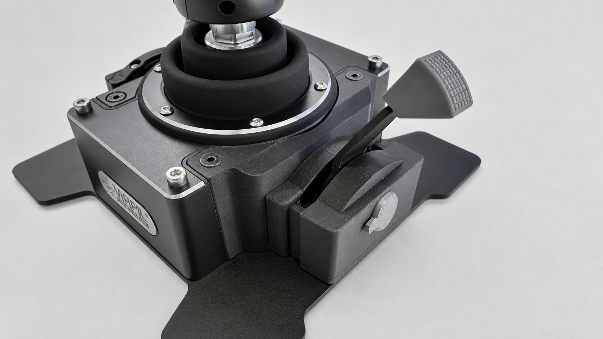
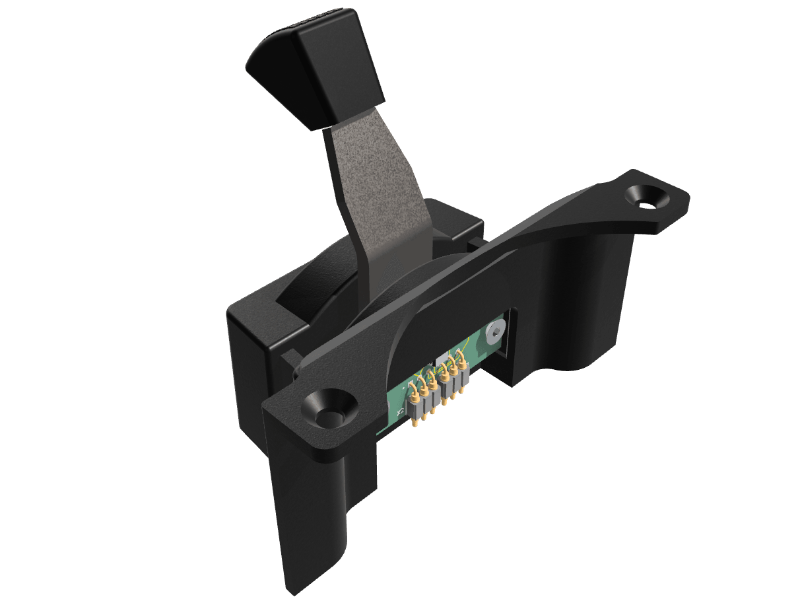

# DIY Throttle Module for the VIRPIL CDT-AEROMAX

An unofficial, community-built throttle module for the VIRPIL CDT-AEROMAX. This project began as a working replacement for the unavailable factory throttle module, but the interface can support much more than the original-style lever.

The design combines 3D-printed mechanical parts, a custom KiCad sensor PCB, and a magnetic position sensor. The module interface also provides a connection for an additional button, leaving room for custom levers, collectives, twin-throttle designs, and other original controls.

## Print files and profiles

For ready-to-print files, tested print profiles, photos, and the illustrated assembly guide, see the [MakerWorld project page](https://makerworld.com/en/models/3148591-virpil-aeromax-throttle-module#profileId-3556232). This repository is the canonical source for the editable CAD, KiCad design, and PCB manufacturing files.

## What is here

| Folder or file | Contents |
| --- | --- |
| `Aeromax_Throttle_Module.3mf` | Printable mechanical model and print setup |
| `assembly.pdf` | Illustrated mechanical assembly guide |
| `Aeromax_Throttle_Module.step` | Neutral CAD exchange model for viewing and remixing |
| `images/` | Project renderings used in this README |
| `kikad/` | Editable KiCad schematic, PCB, and project files |
| `manufacturing/v1.0/` | Tested v1.0 Gerbers and JLCPCB assembly files |

## Build overview

Start with [the illustrated assembly guide](assembly.pdf). It covers the required parts and the complete mechanical assembly sequence.

The PCB is a separate build step. The editable source is in [`kikad/`](kikad/); users who want JLCPCB assembly should use the files in [`manufacturing/v1.0/`](manufacturing/v1.0/).

## Ordering the PCB

For the v1.0 PCB:

1. Upload [`Aeromax_Throttle_Module_Gerbers_v1.0.zip`](manufacturing/v1.0/Aeromax_Throttle_Module_Gerbers_v1.0.zip) to JLCPCB to order bare PCBs.
2. For PCBA, upload [`Aeromax_Throttle_Module_JLCPCB_BOM_v1.0.csv`](manufacturing/v1.0/Aeromax_Throttle_Module_JLCPCB_BOM_v1.0.csv) and [`Aeromax_Throttle_Module_JLCPCB_CPL_v1.0.csv`](manufacturing/v1.0/Aeromax_Throttle_Module_JLCPCB_CPL_v1.0.csv) during the assembly order.
3. Review component availability, placements, rotation, and the JLCPCB preview before paying.

`Aeromax_Throttle_Module_KiCad_BOM_v1.0.csv` and `Aeromax_Throttle_Module_Position_Export_v1.0.csv` are KiCad exports retained for reference. The JLCPCB-specific BOM and CPL are the files intended for JLCPCB assembly.

## Ideas for remixes

This design does not have to look like the original throttle module. Possible adaptations include:

- A longer or shorter lever with a custom grip
- A collective-style control
- Twin levers or a different axis arrangement
- A lever with an integrated button using the module's additional button connection
- A completely new enclosure or mounting approach

If you make a variant, please share photos, source files, and notes that will help the next builder.

## Support

If this project was useful and you would like to support future designs:

## Important

This is an unofficial community project. It is not affiliated with, endorsed by, or supported by VIRPIL Controls. Verify fitment, wiring, and safe operation before installation. You build and use this project at your own risk.

## License

Copyright (c) 2026 ninemind. This project is licensed under the [CERN Open Hardware Licence Version 2 - Strongly Reciprocal](LICENSE) (`CERN-OHL-S-2.0`). You may use, make, modify, and distribute the design and products based on it, provided that distributed modifications remain available under the same licence.
